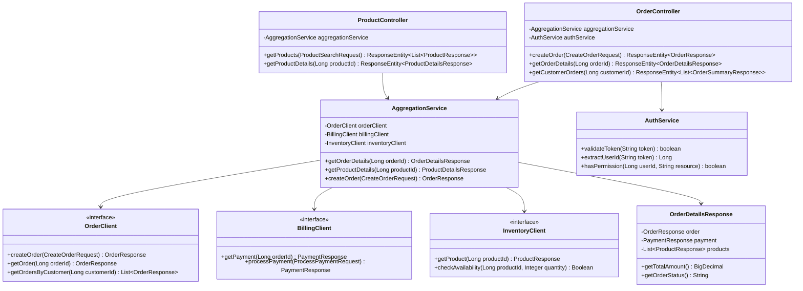

# C4 Model - Code Diagram

## Visão Geral

O Code Diagram representa o nível mais detalhado da arquitetura, mostrando as principais classes, interfaces e suas relações dentro dos microserviços.

## Order Service - Code Structure


## Billing Service - Code Structure


## Inventory Service - Code Structure


## BFF - Code Structure



## Shared Kernel - Common Classes


## Design Patterns Utilizados

### Creational Patterns
- **Factory Pattern**: Criação de eventos de domínio
- **Builder Pattern**: Construção de objetos complexos (Order, Payment)

### Structural Patterns
- **Adapter Pattern**: Clientes Feign para integração
- **Facade Pattern**: BFF como fachada para microserviços
- **Decorator Pattern**: Aspectos de segurança e cache

### Behavioral Patterns
- **Strategy Pattern**: Diferentes métodos de pagamento
- **Observer Pattern**: Event listeners do Kafka
- **Command Pattern**: Commands para operações de negócio
- **State Pattern**: Estados de pedidos e pagamentos

## Convenções de Código

### Nomenclatura
- **Classes**: PascalCase (OrderService, PaymentController)
- **Métodos**: camelCase (createOrder, processPayment)
- **Constantes**: UPPER_SNAKE_CASE (ORDER_CREATED_TOPIC)
- **Packages**: lowercase (com.techbra.order.domain)

### Estrutura de Packages
```
com.techbra.{service}
├── controller/     # REST endpoints
├── service/        # Business logic
├── repository/     # Data access
├── domain/         # Domain entities
├── dto/           # Data transfer objects
├── config/        # Configuration classes
├── exception/     # Custom exceptions
└── event/         # Domain events
```

### Anotações Principais
- `@RestController`: Controllers REST
- `@Service`: Services de negócio
- `@Repository`: Repositórios de dados
- `@Entity`: Entidades JPA
- `@EventListener`: Listeners de eventos
- `@Transactional`: Controle transacional
- `@Cacheable`: Cache de métodos
- `@CircuitBreaker`: Proteção contra falhas

## Validações e Constraints

### Bean Validation
- `@NotNull`: Campos obrigatórios
- `@NotBlank`: Strings não vazias
- `@Min/@Max`: Valores numéricos
- `@Email`: Formato de email
- `@Valid`: Validação cascata

### Custom Validators
- `@ValidOrderStatus`: Status válido de pedido
- `@ValidPaymentMethod`: Método de pagamento válido
- `@ValidStock`: Quantidade de estoque válida

Esta estrutura de código garante alta coesão, baixo acoplamento e facilita a manutenção e evolução do sistema.