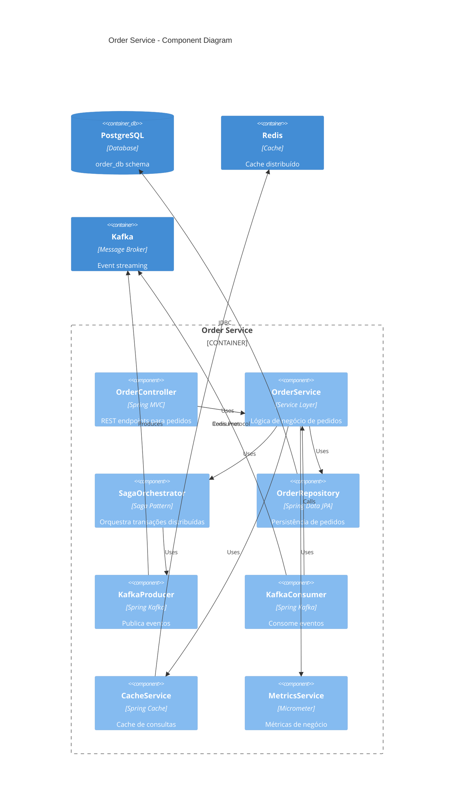
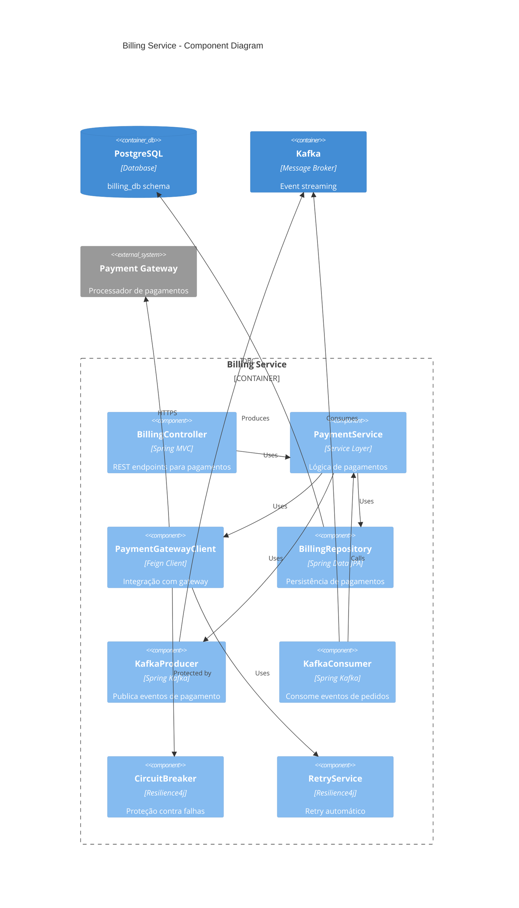
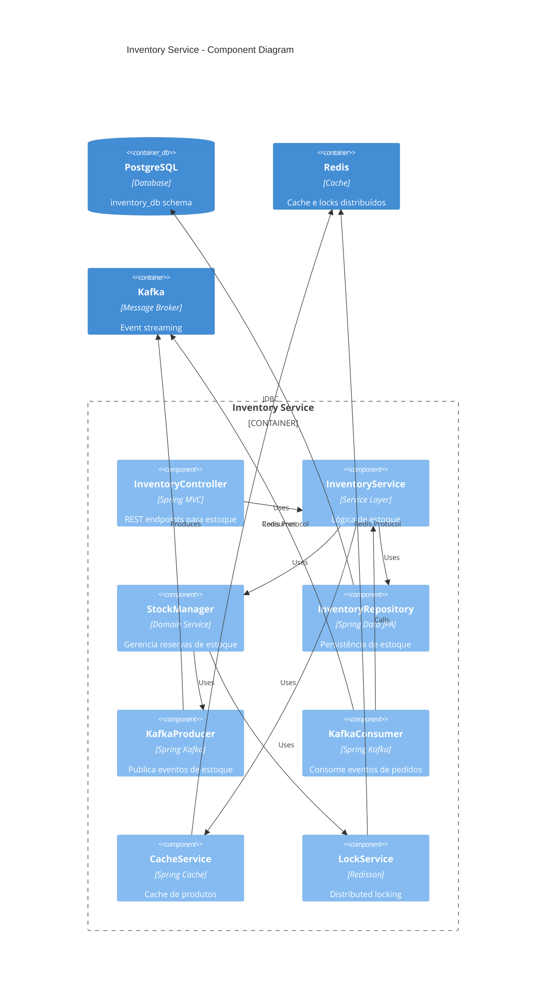
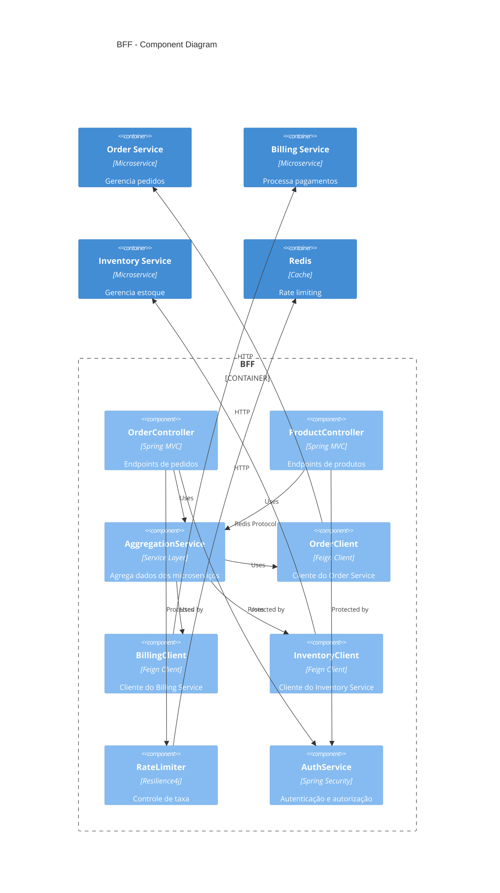

# C4 Model - Component Diagram

## Visão Geral

O Component Diagram detalha os componentes internos de cada microserviço, mostrando a arquitetura hexagonal e os padrões utilizados.

## Order Service - Components

## Billing Service - Components

## Inventory Service - Components

## BFF - Components

## Padrões Arquiteturais

### Arquitetura Hexagonal
Cada microserviço segue a arquitetura hexagonal (ports and adapters):

- **Ports (Interfaces)**:
  - Inbound: Controllers, Event Listeners
  - Outbound: Repositories, External Clients

- **Adapters (Implementações)**:
  - Inbound: REST Controllers, Kafka Consumers
  - Outbound: JPA Repositories, Feign Clients

- **Core (Domínio)**:
  - Services, Domain Objects, Business Rules

### Domain-Driven Design (DDD)

| Microserviço | Bounded Context | Agregados | Entidades |
|--------------|-----------------|-----------|----------|
| **Order Service** | Order Management | Order, OrderItem | Order, Customer |
| **Billing Service** | Payment Processing | Payment, Invoice | Payment, Transaction |
| **Inventory Service** | Stock Management | Product, Stock | Product, StockReservation |

### Padrões de Integração

- **Saga Pattern**: Transações distribuídas (Order Service)
- **Circuit Breaker**: Proteção contra falhas (Billing Service)
- **Event Sourcing**: Histórico de eventos (Kafka)
- **CQRS**: Separação de comandos e consultas
- **Distributed Locking**: Controle de concorrência (Inventory Service)

### Padrões de Resilência

- **Retry**: Tentativas automáticas
- **Timeout**: Limite de tempo para operações
- **Bulkhead**: Isolamento de recursos
- **Rate Limiting**: Controle de taxa de requisições

## Responsabilidades dos Componentes

### Controllers
- Validação de entrada
- Serialização/Deserialização
- Mapeamento de DTOs
- Tratamento de exceções

### Services
- Lógica de negócio
- Orquestração de operações
- Validações de domínio
- Coordenação de transações

### Repositories
- Persistência de dados
- Consultas otimizadas
- Mapeamento objeto-relacional
- Transações de banco

### Clients
- Comunicação entre serviços
- Serialização de requisições
- Tratamento de erros de rede
- Load balancing

### Event Handlers
- Processamento assíncrono
- Idempotência
- Dead letter queues
- Retry policies