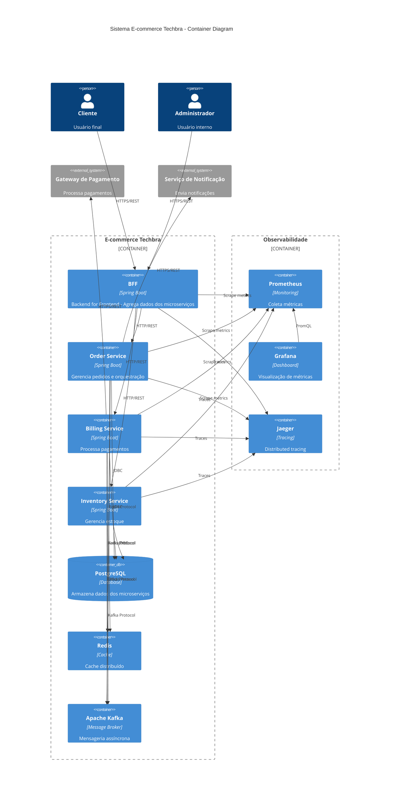

# C4 Model - Container Diagram

## Visão Geral

O Container Diagram mostra a arquitetura interna do sistema E-commerce Techbra, detalhando os microserviços, bancos de dados e suas interações.

## Diagrama de Containers

## Containers

### Microserviços

| Container | Tecnologia | Porta | Responsabilidade |
|-----------|------------|-------|------------------|
| **BFF** | Spring Boot 3.2 | 8084 | - Agregação de dados - Rate limiting - Autenticação - Proxy para microserviços |
| **Order Service** | Spring Boot 3.2 | 8081 | - Criação de pedidos - Orquestração de saga - Gestão de status |
| **Billing Service** | Spring Boot 3.2 | 8082 | - Processamento de pagamentos - Integração com gateway - Gestão de faturas |
| **Inventory Service** | Spring Boot 3.2 | 8083 | - Gestão de estoque - Reserva de produtos - Controle de disponibilidade |

### Infraestrutura

| Container | Tecnologia | Porta | Responsabilidade |
|-----------|------------|-------|------------------|
| **PostgreSQL** | PostgreSQL 15 | 5432 | - Persistência de dados - Transações ACID - Schemas por microserviço |
| **Redis** | Redis 7 | 6379 | - Cache de sessões - Cache de consultas - Rate limiting |
| **Apache Kafka** | Kafka 3.5 | 9092 | - Eventos de domínio - Comunicação assíncrona - Event sourcing |

### Observabilidade

| Container | Tecnologia | Porta | Responsabilidade |
|-----------|------------|-------|------------------|
| **Prometheus** | Prometheus | 9090 | - Coleta de métricas - Alertas - Time series database |
| **Grafana** | Grafana | 3000 | - Dashboards - Visualização - Alertas visuais |
| **Jaeger** | Jaeger | 16686 | - Distributed tracing - Performance monitoring - Dependency analysis |

## Padrões de Comunicação

### Síncrona (REST)
- **BFF ↔ Microserviços**: Agregação de dados
- **Microserviços ↔ Sistemas Externos**: Integrações
- **Cliente ↔ BFF**: APIs públicas

### Assíncrona (Kafka)
- **Order Created**: Order Service → Billing Service, Inventory Service
- **Payment Processed**: Billing Service → Order Service
- **Stock Reserved**: Inventory Service → Order Service
- **Order Completed**: Order Service → Notification Service

## Tópicos Kafka

| Tópico | Producer | Consumer | Evento |
|--------|----------|----------|--------|
| `order-events` | Order Service | Billing, Inventory | OrderCreated, OrderCancelled |
| `payment-events` | Billing Service | Order Service | PaymentProcessed, PaymentFailed |
| `inventory-events` | Inventory Service | Order Service | StockReserved, StockReleased |

## Schemas de Banco

### PostgreSQL
- **order_db**: Pedidos, itens, status
- **billing_db**: Pagamentos, faturas, transações
- **inventory_db**: Produtos, estoque, reservas

### Redis
- **Cache de sessões**: `session:*`
- **Cache de produtos**: `product:*`
- **Rate limiting**: `rate_limit:*`

## Características Técnicas

- **Resilência**: Circuit breaker, retry, timeout
- **Segurança**: JWT, HTTPS, secrets management
- **Escalabilidade**: Horizontal scaling, load balancing
- **Observabilidade**: Metrics, logs, traces
- **Deploy**: Docker + Kubernetes + Helm