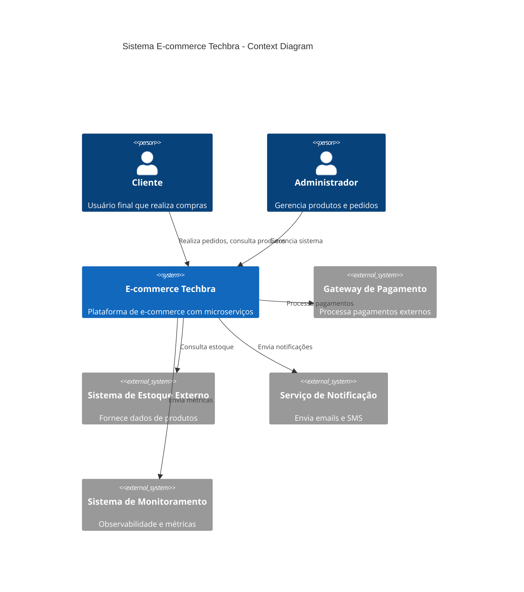

# C4 Model - Context Diagram

## Visão Geral

O Context Diagram representa a visão de mais alto nível do sistema E-commerce Techbra, mostrando como o sistema interage com usuários e sistemas externos.

## Diagrama de Contexto



## Atores

### Pessoas

| Ator | Descrição | Responsabilidades |
|------|-----------|------------------|
| **Cliente** | Usuário final da plataforma | - Navegar catálogo de produtos<br>- Realizar pedidos<br>- Acompanhar status de pedidos |
| **Administrador** | Usuário interno do sistema | - Gerenciar produtos<br>- Monitorar pedidos<br>- Configurar sistema |

### Sistemas Externos

| Sistema | Descrição | Integração |
|---------|-----------|------------|
| **Gateway de Pagamento** | Processa transações financeiras | API REST para autorização e captura |
| **Sistema de Estoque Externo** | Fornece dados de produtos e estoque | API REST para consulta de disponibilidade |
| **Serviço de Notificação** | Envia comunicações aos clientes | API REST para emails e SMS |
| **Sistema de Monitoramento** | Coleta métricas e logs | Prometheus, Grafana, Jaeger |

## Fluxos Principais

### 1. Fluxo de Pedido
```
Cliente → E-commerce Techbra → Gateway de Pagamento
                            → Sistema de Estoque Externo
                            → Serviço de Notificação
```

### 2. Fluxo de Administração
```
Administrador → E-commerce Techbra → Sistema de Estoque Externo
                                  → Sistema de Monitoramento
```

## Características do Sistema

- **Arquitetura**: Microserviços com Event-Driven Architecture
- **Comunicação**: REST APIs + Mensageria assíncrona (Kafka)
- **Persistência**: PostgreSQL + Redis (cache)
- **Observabilidade**: Prometheus + Grafana + Jaeger
- **Deploy**: Kubernetes com Helm Charts

## Requisitos Não-Funcionais

- **Disponibilidade**: 99.9%
- **Latência**: < 200ms para APIs críticas
- **Throughput**: 1000 pedidos/minuto
- **Escalabilidade**: Horizontal via Kubernetes
- **Segurança**: HTTPS, autenticação JWT