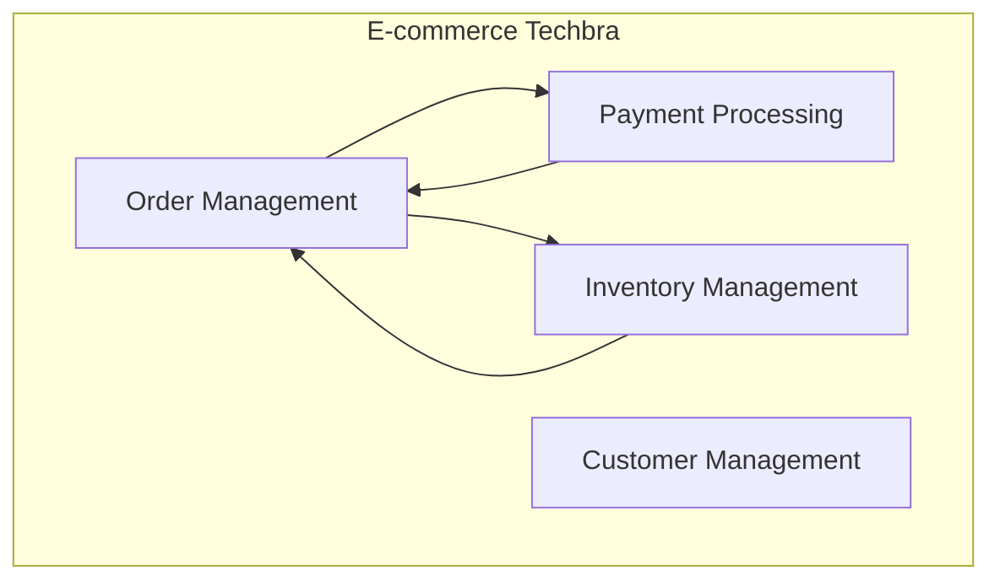

# ADR-002: Separação em Microserviços por Domínio de Negócio

## Status
**Aceita** - 2024-01-15

## Contexto

O sistema de e-commerce Techbra precisa de uma arquitetura que permita:
- Desenvolvimento independente por equipes diferentes
- Deploy independente de funcionalidades
- Escalabilidade granular por domínio
- Tecnologias específicas por contexto
- Isolamento de falhas
- Evolução independente de cada domínio

As opções arquiteturais consideradas foram:
1. **Monolito** tradicional
2. **Monolito modular** com separação por packages
3. **Microserviços** por domínio de negócio
4. **Serverless** functions

## Decisão

Adotamos **arquitetura de microserviços** separados por domínio de negócio, seguindo princípios de Domain-Driven Design (DDD).

### Bounded Contexts Identificados



## Microserviços Definidos

### 1. Order Service
**Bounded Context**: Order Management

**Responsabilidades:**
- Criação e gestão de pedidos
- Orquestração de saga de pedidos
- Histórico de pedidos
- Validações de negócio de pedidos

**Entidades Principais:**
- Order, OrderItem, OrderStatus

**APIs:**
- `POST /orders` - Criar pedido
- `GET /orders/{id}` - Buscar pedido
- `PUT /orders/{id}/status` - Atualizar status
- `DELETE /orders/{id}` - Cancelar pedido

### 2. Billing Service
**Bounded Context**: Payment Processing

**Responsabilidades:**
- Processamento de pagamentos
- Integração com gateways de pagamento
- Gestão de transações financeiras
- Estornos e reembolsos

**Entidades Principais:**
- Payment, Transaction, Invoice

**APIs:**
- `POST /payments` - Processar pagamento
- `GET /payments/{id}` - Buscar pagamento
- `POST /payments/{id}/refund` - Estornar pagamento

### 3. Inventory Service
**Bounded Context**: Inventory Management

**Responsabilidades:**
- Gestão de estoque de produtos
- Reserva e liberação de estoque
- Controle de disponibilidade
- Atualizações de inventário

**Entidades Principais:**
- Product, Stock, StockReservation

**APIs:**
- `GET /products/{id}` - Buscar produto
- `PUT /products/{id}/stock` - Atualizar estoque
- `POST /stock/reserve` - Reservar estoque
- `POST /stock/release` - Liberar estoque

### 4. BFF (Backend for Frontend)
**Bounded Context**: API Gateway

**Responsabilidades:**
- Agregação de dados dos microserviços
- Rate limiting e throttling
- Autenticação e autorização
- Transformação de dados para frontend

## Justificativa da Decisão

### Vantagens dos Microserviços

✅ **Autonomia de Equipes**
- Cada equipe pode desenvolver, testar e deployar independentemente
- Redução de conflitos de merge e dependências

✅ **Escalabilidade Granular**
- Escalar apenas os serviços que precisam
- Otimização de recursos por domínio

✅ **Tecnologia Heterogênea**
- Escolha da melhor tecnologia para cada contexto
- Evolução tecnológica independente

✅ **Isolamento de Falhas**
- Falha em um serviço não derruba todo o sistema
- Degradação graceful de funcionalidades

✅ **Deploy Independente**
- Releases mais frequentes e menores
- Rollback granular por serviço

### Comparação com Alternativas

| Critério | Monolito | Monolito Modular | Microserviços | Serverless |
|----------|----------|------------------|---------------|------------|
| Complexidade | Baixa | Média | Alta | Média |
| Escalabilidade | Limitada | Limitada | Alta | Alta |
| Deploy | Acoplado | Acoplado | Independente | Independente |
| Observabilidade | Simples | Simples | Complexa | Complexa |
| Desenvolvimento | Simples | Médio | Complexo | Médio |
| Operação | Simples | Simples | Complexa | Simples |

## Implementação

### Estrutura de Projeto

```
ecommerce-techbra/
├── bff/                    # Backend for Frontend
├── order-service/          # Gestão de pedidos
├── billing-service/        # Processamento de pagamentos
├── inventory-service/      # Gestão de estoque
├── shared-kernel/          # Código compartilhado
├── charts/                 # Helm charts para deploy
└── infrastructure/         # Configurações de infraestrutura
```

### Comunicação Entre Serviços

**Síncrona (REST):**
- BFF → Microserviços (agregação de dados)
- Microserviços → Sistemas externos

**Assíncrona (Kafka):**
- Eventos de domínio entre microserviços
- Notificações e atualizações de estado

### Shared Kernel

Código compartilhado entre microserviços:
- DTOs de eventos
- Utilitários comuns
- Configurações base
- Exceções customizadas

```java
// Exemplo de evento compartilhado
public class OrderCreatedEvent extends DomainEvent {
    private Long orderId;
    private Long customerId;
    private List<OrderItemDto> items;
    private BigDecimal totalAmount;
    // ...
}
```

## Consequências

### Positivas

✅ **Desenvolvimento Paralelo**: Equipes podem trabalhar independentemente

✅ **Escalabilidade**: Cada serviço escala conforme necessidade

✅ **Resiliência**: Isolamento de falhas entre domínios

✅ **Flexibilidade Tecnológica**: Diferentes stacks por serviço

✅ **Deploy Independente**: Releases mais ágeis e seguras

✅ **Manutenibilidade**: Código mais focado e coeso

### Negativas

❌ **Complexidade Operacional**: Mais serviços para monitorar e gerenciar

❌ **Latência de Rede**: Comunicação entre serviços adiciona latência

❌ **Consistência de Dados**: Transações distribuídas são complexas

❌ **Testing**: Testes de integração mais complexos

❌ **Debugging**: Rastreamento de bugs entre serviços

❌ **Overhead de Infraestrutura**: Mais recursos necessários

## Mitigações

### Complexidade Operacional
- **Kubernetes**: Orquestração automática de containers
- **Helm Charts**: Padronização de deploys
- **Prometheus + Grafana**: Monitoramento centralizado
- **Jaeger**: Distributed tracing

### Latência de Rede
- **Cache distribuído**: Redis para dados frequentes
- **Connection pooling**: Reutilização de conexões
- **Async processing**: Kafka para operações não críticas

### Consistência de Dados
- **Saga Pattern**: Transações distribuídas
- **Event Sourcing**: Histórico de mudanças
- **Eventual Consistency**: Aceitação de inconsistência temporária

### Testing
- **Contract Testing**: Pact para contratos de API
- **Test Containers**: Testes de integração com containers
- **Chaos Engineering**: Testes de resiliência

## Padrões Aplicados

### Database per Service
Cada microserviço tem seu próprio banco de dados:
- `order_db`: Dados de pedidos
- `billing_db`: Dados de pagamentos
- `inventory_db`: Dados de estoque

### API Gateway Pattern
BFF atua como gateway centralizando:
- Autenticação e autorização
- Rate limiting
- Request/response transformation
- Service discovery

### Saga Pattern
Transações distribuídas para operações críticas:
```
Order Created → Reserve Stock → Process Payment → Confirm Order
     ↓              ↓              ↓              ↓
Compensate ← Release Stock ← Refund Payment ← Cancel Order
```

## Métricas de Sucesso

- **Lead Time**: < 2 dias para features simples
- **Deploy Frequency**: > 5 deploys por semana
- **MTTR**: < 30 minutos para incidentes
- **Service Availability**: > 99.9% por serviço
- **API Latency**: < 200ms para 95% das requisições
- **Team Velocity**: Aumento de 30% na entrega de features

## Evolução Futura

### Próximos Microserviços
- **Notification Service**: Gestão de notificações
- **Customer Service**: Gestão de clientes
- **Catalog Service**: Catálogo de produtos
- **Analytics Service**: Métricas e relatórios

### Melhorias Planejadas
- **Service Mesh**: Istio para comunicação segura
- **GraphQL**: API unificada no BFF
- **CQRS**: Separação de comandos e consultas
- **Event Sourcing**: Histórico completo de eventos

## Revisão

Esta decisão deve ser revisada:
- **Trimestralmente**: Avaliação de métricas de performance
- **Semestralmente**: Análise de complexidade vs benefícios
- **Anualmente**: Consideração de consolidação ou divisão de serviços

## Referências

- [Microservices Patterns - Chris Richardson](https://microservices.io/)
- [Domain-Driven Design - Eric Evans](https://domainlanguage.com/ddd/)
- [Building Microservices - Sam Newman](https://samnewman.io/books/building_microservices/)
- [Spring Boot Microservices](https://spring.io/microservices)